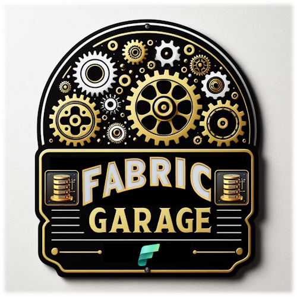

# Fabric Garage

🧑‍🔧️ Welcome to **Fabric Garage**! 🔧

This repository is our **garage**, dedicated to exploring and understanding the features and nuances of **Microsoft Fabric**.
Each week, you'll find a new PDF that guides you through various aspects of Microsoft Fabric, providing you with practical and detailed knowledge.

## What's in the Repository?

In Fabric Garage, you will find:

- **Weekly Guides**: Every week, a new PDF is added to the collection, covering different topics on Microsoft Fabric
- **Additional Resources**: Links to external resources, official documentation, and other useful guides to further deepen your knowledge

## Why "Garage"?

The term "garage" evokes the image of a place where things are built, repaired, and improved. Similarly, Fabric Garage is the place where you can "improve" your data knowledge, "build" new skills, and "enhance" your data management and analytics capabilities with Microsoft Fabric.

## Are You a Fabricator?

If you're a **fabricator** – someone looking to craft, create, and innovate with data – you're in the right place! 
Here in Fabric Garage, you'll find all the tools and knowledge you need to fabricate your data solutions and become a master in Microsoft Fabric.

## How to Use This Repository

1. **Browse the PDFs**: Explore the weekly PDFs in the main folder. Each document is dated to help you follow the order of publication.
2. **Deep Dive into Content**: Carefully read the guides and practice the examples provided.
3. **Contribute**: You are welcome to contribute to the repository. If you have suggestions, improvements, or new guides, feel free to open a pull request or create an issue.

## Weekly Releases

Below is the list of weekly PDF releases:

- [Week 0: The Starting Line](./000FabricGarage_TheStartingLine.pdf)
- [Week 1: Common Analytics Scenarios](./001FabricGarage_CommonAnalyticsScenarios.pdf)
- [Week 2: Deployment Patterns](./002FabricGarage_DeploymentPatterns.pdf)
- [Week 3: The Persona Picker](./003FabricGarage_ThePersonaPicker.pdf)
- [Week 4: Copilot Experience](./004FabricGarage_CopilotExperience.pdf)
- [Week 5: Understanding Capacities](./005FabricGarage_UnderstandingCapacities.pdf)
- [Week 6: Direct Lake](./006FabricGarage_DirectLake.pdf)
- [Week 7: Warehouse Lakehouse Dilemma](./007FabricGarage_DWH_LKH.pdf)

## Contact

For any questions, suggestions, or feedback, feel free to contact me through the repository's issue system.

---

Thank you for being part of our **Fabric Garage**! 
I hope these guides help you navigate the world of Microsoft Fabric with skill and confidence.

🚀 Happy learning! 🚀
